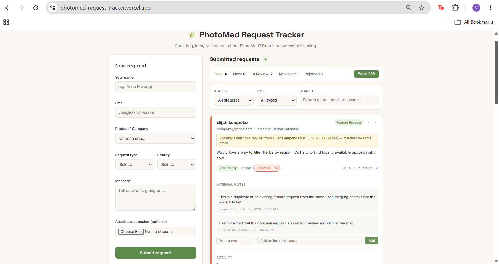
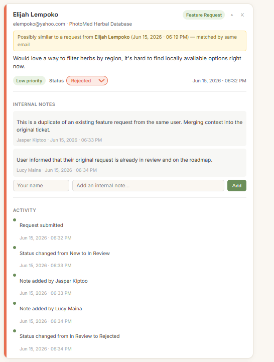
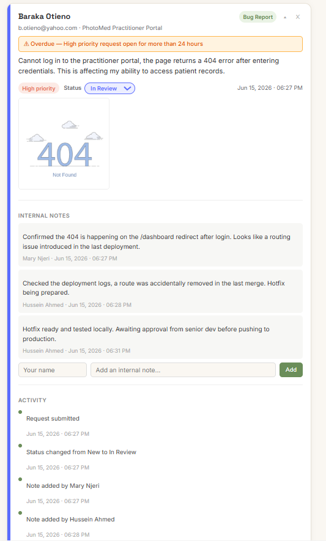

# PhotoMed Request Tracker

A simple web app for submitting and managing requests (bugs, feature requests, feedback, partnerships, etc.) — built for the PhotoMed software engineering attachment assessment.

## Live Demo
https://photomed-request-tracker.vercel.app/

## Preview




## What it does

- Submit a request through a form (name, email, product/company, type, priority, message)
- New requests appear instantly at the top of the list
- Each request has a status (`New`, `In Review`, `Resolved`, `Rejected`) that can be changed directly from its card
- Filter requests by **status** and **type**, and **search** by name, email, message, or company
- A summary bar shows the total number of requests and a breakdown by status
- Delete a request directly from its card
- Attach a screenshot (under 1MB) to a request - shown as a thumbnail on the card, click to view fullscreen
- Export all requests to a CSV file
- Duplicate detection — new requests are automatically flagged if they match an existing one by same email or similar message text
- Internal notes per request (with author name and timestamp) — for team use, hidden on General Feedback requests
- Auto-reply email preview shown on cards when a request is marked as Resolved
- Full activity timeline per request — logs when it was submitted, every status change, and every note added
- High priority requests open for more than 24 hours are flagged as overdue
- Cards are collapsible — core info always visible, extra details expand on demand
- Data persists across page refreshes using `localStorage`

## Tech stack

- **React + Vite**
- Plain CSS (no UI library) — Google Fonts (Space Grotesk + Inter)

## How to run locally

```bash
npm install
npm run dev
```

Then open the local URL Vite prints (usually `http://localhost:5173`).

To build for production:

```bash
npm run build
npm run preview
```

## Project structure

```
src/
├── App.jsx                  # top-level state (requests, filters)
├── main.jsx                 # React entry point
├── components/
│   ├── RequestForm.jsx      # form + validation + attachment handling
│   ├── RequestFilters.jsx   # status/type/search controls
│   ├── RequestList.jsx      # list + empty states
│   └── RequestCard.jsx      # request card (status, delete, notes, timeline, collapse)
├── data/
│   └── options.js           # PhotoMed product list, types, priorities, statuses
├── utils/
│   ├── storage.js           # localStorage data layer + CSV export + duplicate detection + activity logging
│   └── validation.js        # form validation + date formatting + auto-reply generator
└── styles/
    └── index.css             # global styles
```

## Design decisions

- **Why localStorage and not a database?** The brief explicitly says localStorage is acceptable for the basic version, and a database is an "optional improvement." I've worked with MongoDB before and considered it, but that would mean setting up and hosting a backend (Express + MongoDB Atlas), which felt like more moving parts than this assessment needed and more places for a deployment to break right before the deadline.

  Instead, `utils/storage.js` exposes a small set of functions (`getRequests`, `addRequest`, `updateRequestStatus`, `deleteRequest`) that the rest of the app calls. To swap in MongoDB later, I'd rewrite the insides of these functions to call an API (and make them `async`) the components wouldn't need to change much beyond `await`ing them.

- **Component breakdown.** I split the UI into `RequestForm`, `RequestFilters`, `RequestList`, and `RequestCard` so each piece has one job and is easy to follow. `App.jsx` owns the shared state (the list of requests and the active filters) and passes data down / handlers down as props.

- **One filter requirement → I added two filters + search.** Status and type filters, plus free-text search across name/email/message/company.

- **PhotoMed branding.** Since PhotoMed is an AI-powered traditional medicine platform, I picked a sage-green/herbal accent color and a small leaf icon, and used PhotoMed's actual product areas as placeholder options in the "Product/Company" dropdown.

- **Form validation.** All fields are required, with inline error messages. Email is checked against a basic pattern.

- **Duplicate detection.** When a new request is submitted, it's checked against all existing ones using word-overlap scoring on the message text, with a similarity threshold of 0.3. Same-email matches are also flagged. This runs entirely client-side in `storage.js` with no extra dependencies.

- **Activity timeline.** Every request carries an `activity: []` array that logs key events — submission, status changes, and notes with timestamps. This mirrors the audit trail pattern used in real support tools like Zendesk.

- **Image attachments.** Stored as base64 in localStorage, capped at 1MB per image. The fullscreen preview uses a React Portal so it isn't affected by CSS transforms on the card.

- **Collapsible cards.** Cards default to showing core info (name, email, message, status, priority, date). Notes, activity, attachments, and email previews expand on demand to keep the list scannable.

- **Overdue escalation.** High priority requests that remain open (New or In Review) for more than 24 hours are flagged with a warning badge, a lightweight SLA indicator without needing a backend scheduler.

- **CSV export.** Generated client-side from the current request list, no backend needed.

## What I completed

- Form with all required fields and validation
- Requests appear in the list immediately on submit
- Status can be changed per request (New / In Review / Resolved / Rejected)
- Filter by status, filter by type, and search by text — all three work
- Data persists via localStorage across refreshes
- Empty states for "no requests yet" and "no results match your filters"
- Responsive layout (form stacks above the list on smaller screens)
- Summary statistics bar (total requests + counts by status)
- Delete requests
- Image attachments with fullscreen preview
- CSV export of all requests
- Duplicate detection (email + message similarity)
- Internal notes with author attribution
- Auto-reply email preview for resolved requests
- Full activity timeline per request
- Overdue escalation badge for high priority requests
- Collapsible cards

## What I didn't get to / would improve with more time

- A real backend with MongoDB, so requests are shared across devices/users instead of being stuck in one browser
- Authentication, so only admins can change statuses
- Edit requests after submission
- Automated tests for validation and filtering logic
- "Sort by" options (e.g. newest/oldest, priority)

## A note on AI tools

I used AI assistance to help debug a Git issue I ran into (a BOM encoding problem that was causing .gitignore to not work as expected) and to talk through how I'd structure the storage utility if I were to swap localStorage for a real database later.
